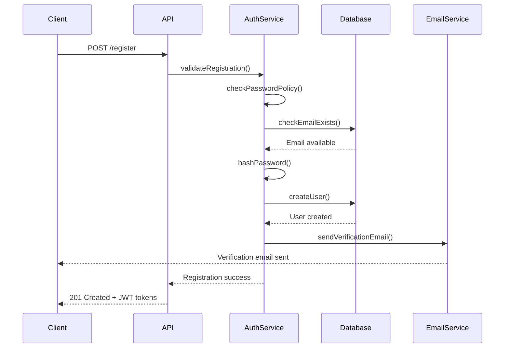
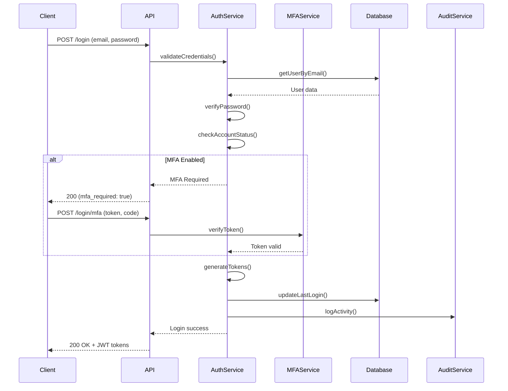
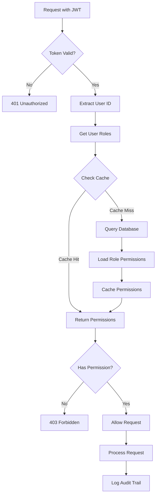
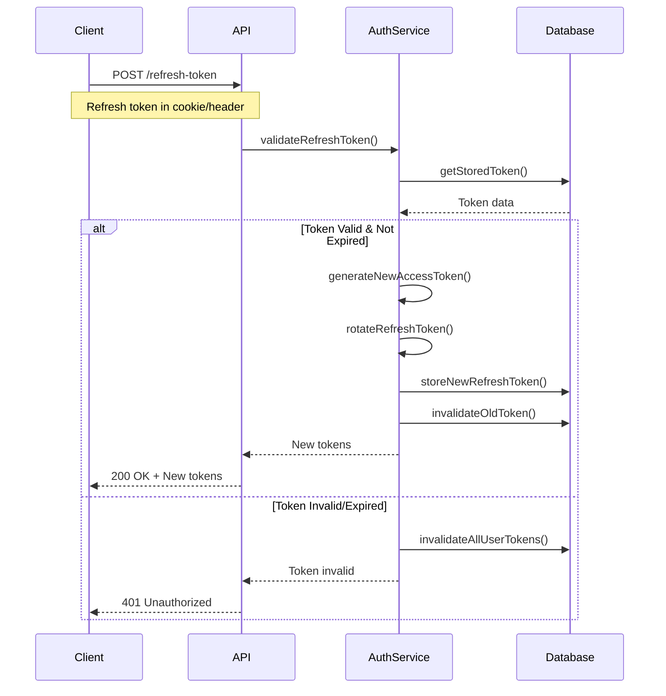

<div align="center">
  <h1>🔐 CRAFTA</h1>
  <p><strong>Production-Ready Authentication & Authorization System</strong></p>
  
  [](https://www.npmjs.com/package/crafta)
  [](LICENSE)
  [](https://nodejs.org/)
  [](CONTRIBUTING.md)
</div>

---

## 📖 Table of Contents

- [About](#about)
- [Why CRAFTA?](#why-crafta)
- [Architecture Overview](#architecture-overview)
- [Features](#features)
- [Data Flow Diagrams](#data-flow-diagrams)
- [Installation](#installation)
- [Quick Start](#quick-start)
- [Advanced Configuration](#advanced-configuration)
- [API Reference](#api-reference)
- [Security](#security)
- [Roadmap](#roadmap)
- [Contributing](#contributing)
- [Team](#team)
- [License](#license)

---

## 🎯 About

**CRAFTA** is an enterprise-grade authentication and authorization system built for modern Node.js applications. We designed this library after struggling to find a comprehensive auth solution that didn't require extensive configuration or compromise on security features.

### 🤝 Built By Two Developers

**Created by:** [Kalpan](https://github.com/Kalpan2007) & [Dax](https://github.com/daxp472)

This project was built by two passionate developers—Kalpan and Dax—who were tired of implementing the same authentication logic over and over again. We wanted to name this library "CRAFTA" because it represents our vision of **craft**ing **a**uthentication solutions that are both powerful and elegant. However, we couldn't secure the name "CRAFTA" for various reasons, so we're using this name for our GitHub repository and package.

CRAFTA is our solution to the authentication problem—a battle-tested, production-ready auth system that just works. This library is the first in our suite of developer tools, with [**KALPAN-CHAT**](https://github.com/Kalpan2007/kalpan-chat) (a powerful real-time messaging system for websites) currently in development.

---

## 🚀 Why CRAFTA?

| Feature | CRAFTA | Others |
|---------|----------|---------|
| **Setup Time** | < 5 minutes | Hours |
| **Built-in RBAC** | ✅ Advanced | ⚠️ Basic/None |
| **MFA/2FA** | ✅ Complete | ⚠️ Plugin Required |
| **Audit Logging** | ✅ Production-Ready | ❌ Manual |
| **Social Auth** | ✅ Pre-configured | ⚠️ Complex Setup |
| **Password Policies** | ✅ Customizable | ⚠️ Limited |
| **TypeScript Support** | ✅ Full | ⚠️ Partial |
| **Email Templates** | ✅ Beautiful Defaults | ❌ DIY |

---

## 🏗️ Architecture Overview

CRAFTA follows a modular, layered architecture designed for scalability and maintainability:

```
┌─────────────────────────────────────────────────────────┐
│                    Application Layer                     │
│              (Your Express/Node.js App)                  │
└─────────────────────────────────────────────────────────┘
                           ▼
┌─────────────────────────────────────────────────────────┐
│                     CRAFTA Middleware                    │
│  ┌──────────────┐  ┌──────────────┐  ┌──────────────┐ │
│  │ Auth Filter  │  │ Validation   │  │   RBAC       │ │
│  │  Middleware  │  │  Middleware  │  │  Middleware  │ │
│  └──────────────┘  └──────────────┘  └──────────────┘ │
└─────────────────────────────────────────────────────────┘
                           ▼
┌─────────────────────────────────────────────────────────┐
│                     Service Layer                        │
│  ┌──────────────┐  ┌──────────────┐  ┌──────────────┐ │
│  │    Auth      │  │     Role     │  │    Audit     │ │
│  │   Service    │  │   Service    │  │   Service    │ │
│  └──────────────┘  └──────────────┘  └──────────────┘ │
└─────────────────────────────────────────────────────────┘
                           ▼
┌─────────────────────────────────────────────────────────┐
│                      Model Layer                         │
│  ┌──────────────┐  ┌──────────────┐  ┌──────────────┐ │
│  │     User     │  │     Role     │  │  Audit Log   │ │
│  │    Model     │  │    Model     │  │    Model     │ │
│  └──────────────┘  └──────────────┘  └──────────────┘ │
└─────────────────────────────────────────────────────────┘
                           ▼
┌─────────────────────────────────────────────────────────┐
│                  Database (MongoDB)                      │
└─────────────────────────────────────────────────────────┘
```

---

## ✨ Features

### 🔐 Authentication
- **Email/Password** - Traditional authentication with secure password hashing (bcrypt)
- **Social Login** - Pre-configured OAuth integrations (Google, Facebook, GitHub, LinkedIn)
- **JWT Sessions** - Stateless authentication with access & refresh tokens
- **Token Rotation** - Automatic refresh token rotation for enhanced security
- **Session Management** - Track active sessions, force logout from all devices

### 👥 Authorization (RBAC)
- **Dynamic Role Creation** - Create custom roles at runtime
- **Granular Permissions** - Define permissions per resource and action
- **Resource-Based Access** - Control access to specific resources
- **Role Hierarchy** - Implement role inheritance and precedence
- **Permission Caching** - Optimized permission checks with intelligent caching

### 🔒 Security
- **Multi-Factor Authentication** - TOTP-based 2FA with QR code generation
- **Password Policies** - Enforce complexity, expiry, and history rules
- **Account Lockout** - Automatic protection against brute force attacks
- **Rate Limiting** - Configurable request throttling
- **IP Whitelisting/Blacklisting** - Network-level access control
- **Security Headers** - Automatic configuration of security-related headers

### 📧 Email System
- **Verification Emails** - Beautiful, customizable email verification
- **Password Reset** - Secure token-based password recovery
- **Login Alerts** - Notify users of suspicious login attempts
- **Custom Templates** - Full control over email design and content
- **Multi-Provider Support** - Works with SendGrid, Mailgun, AWS SES, SMTP

### 📝 Audit & Compliance
- **Activity Logging** - Comprehensive user action tracking
- **Security Events** - Detailed logs of security-related events
- **Session Tracking** - Monitor active and historical sessions
- **Compliance Reports** - Generate audit reports for compliance requirements
- **Data Retention** - Configurable log retention and archival

### 🛠️ Developer Experience
- **TypeScript First** - Complete type definitions included
- **Zero Configuration** - Sensible defaults that just work
- **Extensive Documentation** - Clear examples and API references
- **Flexible Integration** - Works with Express, Koa, Fastify, and more
- **Testing Utilities** - Built-in helpers for unit and integration tests

---

## 📊 Data Flow Diagrams

### Registration Flow



### Login Flow with MFA



### Permission Check Flow



### Token Refresh Flow



---

## 📦 Installation

```bash
npm install crafta
```

### Prerequisites

- Node.js >= 14.0.0
- MongoDB >= 4.0
- npm or yarn

---

## 🚀 Quick Start

### Basic Setup (Express.js)

```javascript
const express = require('express');
const { CraftaAuth } = require('crafta');

const app = express();

// Initialize CRAFTA with minimal config
const auth = new CraftaAuth({
  secret: process.env.JWT_SECRET,
  mongoUri: process.env.MONGO_URI,
  emailConfig: {
    provider: 'smtp',
    host: process.env.SMTP_HOST,
    port: 587,
    auth: {
      user: process.env.SMTP_USER,
      pass: process.env.SMTP_PASS
    }
  }
});

// Mount auth routes
app.use('/auth', auth.router);

// Protected route example
app.get('/dashboard', 
  auth.middleware.authenticate(),
  auth.middleware.authorize(['admin', 'user']),
  (req, res) => {
    res.json({ 
      message: 'Welcome to dashboard',
      user: req.user 
    });
  }
);

app.listen(3000, () => {
  console.log('Server running on port 3000');
});
```

### With TypeScript

```typescript
import express, { Request, Response } from 'express';
import { CraftaAuth, AuthConfig } from 'crafta';

const app = express();

const config: AuthConfig = {
  secret: process.env.JWT_SECRET!,
  mongoUri: process.env.MONGO_URI!,
  features: {
    emailVerification: true,
    mfa: true,
    socialAuth: ['google', 'github']
  }
};

const auth = new CraftaAuth(config);

app.use('/auth', auth.router);

app.get('/profile',
  auth.middleware.authenticate(),
  async (req: Request, res: Response) => {
    const user = await auth.services.user.getProfile(req.user!.id);
    res.json(user);
  }
);

app.listen(3000);
```

---

## ⚙️ Advanced Configuration

### Complete Configuration Example

```javascript
const { CraftaAuth } = require('crafta');

const auth = new CraftaAuth({
  // Core Settings
  secret: process.env.JWT_SECRET,
  mongoUri: process.env.MONGO_URI,
  
  // Token Configuration
  tokens: {
    accessToken: {
      expiresIn: '15m',
      algorithm: 'HS256'
    },
    refreshToken: {
      expiresIn: '7d',
      rotating: true
    }
  },
  
  // Routes (optional - defaults shown)
  routes: {
    prefix: '/auth',
    register: '/register',
    login: '/login',
    logout: '/logout',
    refresh: '/refresh',
    verify: '/verify/:token',
    forgotPassword: '/forgot-password',
    resetPassword: '/reset-password/:token',
    mfa: {
      setup: '/mfa/setup',
      verify: '/mfa/verify',
      disable: '/mfa/disable'
    }
  },
  
  // Password Policy
  passwordPolicy: {
    minLength: 12,
    maxLength: 128,
    requireUppercase: true,
    requireLowercase: true,
    requireNumbers: true,
    requireSpecialChars: true,
    preventCommonPasswords: true,
    preventUserInfo: true,
    expiryDays: 90,
    historyCount: 5
  },
  
  // Account Security
  security: {
    maxLoginAttempts: 5,
    lockoutDuration: 30, // minutes
    sessionTimeout: 60, // minutes
    concurrentSessions: 3,
    ipWhitelist: [],
    ipBlacklist: []
  },
  
  // Features
  features: {
    emailVerification: true,
    loginAlerts: true,
    mfa: true,
    socialAuth: ['google', 'github', 'facebook'],
    passwordReset: true,
    sessionManagement: true,
    auditLogging: true
  },
  
  // Email Configuration
  emailConfig: {
    provider: 'smtp', // or 'sendgrid', 'mailgun', 'ses'
    host: process.env.SMTP_HOST,
    port: 587,
    secure: false,
    auth: {
      user: process.env.SMTP_USER,
      pass: process.env.SMTP_PASS
    },
    from: {
      name: 'CRAFTA',
      email: 'noreply@yourdomain.com'
    },
    templates: {
      verification: './templates/verification.html',
      resetPassword: './templates/reset-password.html',
      loginAlert: './templates/login-alert.html'
    }
  },
  
  // Social Auth Providers
  socialAuth: {
    google: {
      clientID: process.env.GOOGLE_CLIENT_ID,
      clientSecret: process.env.GOOGLE_CLIENT_SECRET,
      callbackURL: '/auth/google/callback',
      scope: ['profile', 'email']
    },
    github: {
      clientID: process.env.GITHUB_CLIENT_ID,
      clientSecret: process.env.GITHUB_CLIENT_SECRET,
      callbackURL: '/auth/github/callback'
    }
  },
  
  // Audit Configuration
  audit: {
    enabled: true,
    events: ['login', 'logout', 'register', 'password_change', 'mfa_enable'],
    retention: 90, // days
    includeIP: true,
    includeUserAgent: true
  },
  
  // Rate Limiting
  rateLimit: {
    login: {
      windowMs: 15 * 60 * 1000, // 15 minutes
      max: 5
    },
    register: {
      windowMs: 60 * 60 * 1000, // 1 hour
      max: 3
    },
    resetPassword: {
      windowMs: 60 * 60 * 1000,
      max: 3
    }
  },
  
  // Database Options
  database: {
    options: {
      useNewUrlParser: true,
      useUnifiedTopology: true
    },
    collections: {
      users: 'users',
      roles: 'roles',
      sessions: 'sessions',
      auditLogs: 'audit_logs'
    }
  }
});
```

---

## 📚 API Reference

### Authentication Endpoints

#### POST `/auth/register`

Register a new user account.

**Request Body:**
```json
{
  "email": "user@example.com",
  "password": "SecureP@ss123",
  "name": "John Doe",
  "metadata": {
    "phoneNumber": "+1234567890"
  }
}
```

**Response (201 Created):**
```json
{
  "success": true,
  "message": "Registration successful. Please verify your email.",
  "data": {
    "user": {
      "id": "user_123456",
      "email": "user@example.com",
      "name": "John Doe",
      "emailVerified": false,
      "createdAt": "2026-02-02T10:30:00Z"
    },
    "tokens": {
      "accessToken": "eyJhbGciOiJIUzI1NiIs...",
      "refreshToken": "eyJhbGciOiJIUzI1NiIs...",
      "expiresIn": 900
    }
  }
}
```

---

#### POST `/auth/login`

Authenticate a user and receive JWT tokens.

**Request Body:**
```json
{
  "email": "user@example.com",
  "password": "SecureP@ss123",
  "rememberMe": true
}
```

**Response (200 OK):**
```json
{
  "success": true,
  "data": {
    "user": {
      "id": "user_123456",
      "email": "user@example.com",
      "name": "John Doe",
      "roles": ["user"]
    },
    "tokens": {
      "accessToken": "eyJhbGciOiJIUzI1NiIs...",
      "refreshToken": "eyJhbGciOiJIUzI1NiIs...",
      "expiresIn": 900
    },
    "mfaRequired": false
  }
}
```

---

#### POST `/auth/refresh`

Refresh access token using refresh token.

**Request Headers:**
```
Authorization: Bearer <refresh_token>
```

**Response (200 OK):**
```json
{
  "success": true,
  "data": {
    "accessToken": "eyJhbGciOiJIUzI1NiIs...",
    "refreshToken": "eyJhbGciOiJIUzI1NiIs...",
    "expiresIn": 900
  }
}
```

---

### Role & Permission Management

```javascript
const { roleService } = auth.services;

// Create a role
const role = await roleService.createRole({
  name: 'moderator',
  description: 'Content moderator role',
  permissions: [
    {
      resource: 'posts',
      actions: ['read', 'update', 'delete']
    },
    {
      resource: 'comments',
      actions: ['read', 'update', 'delete']
    }
  ]
});

// Assign role to user
await roleService.assignRole(userId, 'moderator');

// Check permission
const hasPermission = await roleService.hasPermission(
  userId,
  'posts',
  'delete'
);

// Middleware usage
app.delete('/posts/:id',
  auth.middleware.authenticate(),
  auth.middleware.requirePermission('posts', 'delete'),
  async (req, res) => {
    // Delete post logic
  }
);
```

---

### Multi-Factor Authentication

```javascript
const { mfaService } = auth.services;

// Generate MFA secret for user
const setupMFA = async (userId, userEmail) => {
  const { secret, qrCode, backupCodes } = await mfaService.setup(
    userId,
    userEmail,
    'MyApp'
  );
  
  return {
    secret,      // Store this securely
    qrCode,      // Display to user for scanning
    backupCodes  // Give to user for emergency access
  };
};

// Verify and enable MFA
const enableMFA = async (userId, token) => {
  const isValid = await mfaService.verify(userId, token);
  if (isValid) {
    await mfaService.enable(userId);
    return true;
  }
  return false;
};

// Disable MFA
await mfaService.disable(userId);
```

---

### Audit Logging

```javascript
const { auditService } = auth.services;

// Manual audit log
await auditService.log({
  userId: 'user_123456',
  action: 'document_download',
  resource: 'confidential_report.pdf',
  ipAddress: req.ip,
  userAgent: req.headers['user-agent'],
  metadata: {
    documentId: 'doc_789',
    fileSize: '2.5MB'
  }
});

// Query audit logs
const logs = await auditService.getLogs({
  userId: 'user_123456',
  action: 'login',
  startDate: new Date('2026-01-01'),
  endDate: new Date('2026-02-01'),
  limit: 50
});

// Get security events
const securityEvents = await auditService.getSecurityEvents({
  userId: 'user_123456',
  eventTypes: ['failed_login', 'password_change', 'mfa_disabled']
});

// Export audit report
const report = await auditService.exportReport({
  format: 'csv', // or 'json', 'pdf'
  startDate: new Date('2026-01-01'),
  endDate: new Date('2026-01-31')
});
```

---

## 🔒 Security

### Security Features

1. **Password Security**
   - Bcrypt hashing with configurable salt rounds
   - Password strength validation
   - Common password prevention
   - Password history tracking
   - Expiry enforcement

2. **Token Security**
   - Short-lived access tokens (default: 15 minutes)
   - Refresh token rotation
   - Token blacklisting on logout
   - Secure HTTP-only cookies
   - CSRF protection

3. **Account Protection**
   - Brute force protection with exponential backoff
   - Account lockout after failed attempts
   - Suspicious login detection
   - IP-based restrictions
   - Concurrent session limits

4. **Data Protection**
   - Sensitive data encryption at rest
   - TLS/SSL enforcement
   - Input sanitization
   - SQL injection prevention
   - XSS protection

### Security Best Practices

```javascript
// 1. Use environment variables for secrets
require('dotenv').config();

const auth = new CraftaAuth({
  secret: process.env.JWT_SECRET, // Never hardcode!
  mongoUri: process.env.MONGO_URI
});

// 2. Enable HTTPS in production
if (process.env.NODE_ENV === 'production') {
  app.use((req, res, next) => {
    if (!req.secure) {
      return res.redirect('https://' + req.headers.host + req.url);
    }
    next();
  });
}

// 3. Set secure cookie options
app.use(auth.middleware.secureCookies({
  httpOnly: true,
  secure: process.env.NODE_ENV === 'production',
  sameSite: 'strict',
  maxAge: 7 * 24 * 60 * 60 * 1000
}));

// 4. Implement CORS properly
const cors = require('cors');
app.use(cors({
  origin: process.env.ALLOWED_ORIGINS.split(','),
  credentials: true
}));

// 5. Add security headers
const helmet = require('helmet');
app.use(helmet());

// 6. Enable rate limiting
app.use('/auth', auth.middleware.rateLimit({
  windowMs: 15 * 60 * 1000,
  max: 100
}));

// 7. Monitor and rotate secrets regularly
// Set up a reminder to rotate JWT_SECRET every 90 days
```

### Vulnerability Reporting

Found a security issue? Please email us at **security@crafta.dev** instead of opening a public issue. We take security seriously and will respond within 48 hours.

---

## 🗺️ Roadmap

### Current Version: v1.0.0

### Planned Features

#### v1.1.0 (Q2 2026)
- [ ] **Biometric Authentication** - Face ID, Touch ID support
- [ ] **WebAuthn/FIDO2** - Passwordless authentication
- [ ] **Device Fingerprinting** - Enhanced device tracking
- [ ] **GraphQL Support** - First-class GraphQL API
- [ ] **Redis Session Store** - High-performance session management

#### v1.2.0 (Q3 2026)
- [ ] **Magic Link Login** - Email-based passwordless auth
- [ ] **SSO Integration** - SAML 2.0, OAuth 2.0 providers
- [ ] **Advanced Analytics Dashboard** - Visual analytics for auth events
- [ ] **Geo-blocking** - Location-based access control
- [ ] **Compliance Pack** - GDPR, HIPAA, SOC2 helpers

#### v2.0.0 (Q4 2026)
- [ ] **Microservices Architecture** - Standalone auth microservice
- [ ] **Multi-tenancy** - Built-in tenant isolation
- [ ] **API Key Management** - Create and manage API keys
- [ ] **Webhook Events** - Real-time auth event notifications
- [ ] **Admin Dashboard** - Web-based admin interface

### Integration with KALPAN-CHAT

We're building **CRAFTA** to work seamlessly with our upcoming [**KALPAN-CHAT**](https://github.com/Kalpan2007/kalpan-chat) messaging system. Once released, you'll be able to:

- Use CRAFTA for user authentication in KALPAN-CHAT
- Share user sessions between both systems
- Implement role-based chat permissions
- Track messaging activity in unified audit logs

Expected release: **Q3 2026**

---

## 🤝 Contributing

We love contributions! Whether it's bug reports, feature requests, or code contributions, we welcome them all.

### How to Contribute

1. **Fork the repository**
2. **Create a feature branch** (`git checkout -b feature/AmazingFeature`)
3. **Commit your changes** (`git commit -m 'Add some AmazingFeature'`)
4. **Push to the branch** (`git push origin feature/AmazingFeature`)
5. **Open a Pull Request**

### Development Setup

```bash
# Clone your fork
git clone https://github.com/YOUR_USERNAME/crafta.git
cd crafta

# Install dependencies
npm install

# Set up environment variables
cp .env.example .env
# Edit .env with your configuration

# Run tests
npm test

# Run in development mode
npm run dev
```

### Code Style

We use ESLint and Prettier for code formatting. Please ensure your code passes linting:

```bash
npm run lint
npm run format
```

### Commit Convention

We follow [Conventional Commits](https://www.conventionalcommits.org/):

- `feat:` - New feature
- `fix:` - Bug fix
- `docs:` - Documentation changes
- `style:` - Code style changes (formatting, etc.)
- `refactor:` - Code refactoring
- `test:` - Adding or updating tests
- `chore:` - Maintenance tasks

Example:
```bash
git commit -m "feat: add WebAuthn support for passwordless authentication"
```

---

## 👥 Team

<div align="center">

### Built with ❤️ by

<table>
  <tr>
    <td align="center">
      <a href="https://github.com/Kalpan2007">
        
        <br />
        <sub><b>Kalpan</b></sub>
      </a>
      <br />
      <sub>Core Architecture & Security</sub>
    </td>
    <td align="center">
      <a href="https://github.com/daxp472">
        
        <br />
        <sub><b>Dax</b></sub>
      </a>
      <br />
      <sub>API Design & Documentation</sub>
    </td>
  </tr>
</table>

### Connect With Us

[](https://github.com/Kalpan2007)
[](https://twitter.com/craftaauth)
[](https://discord.gg/crafta)

</div>

---

## 📄 License

This project is licensed under the **MIT License** - see the [LICENSE](LICENSE) file for details.

### What This Means

✅ Commercial use  
✅ Modification  
✅ Distribution  
✅ Private use  

❌ Liability  
❌ Warranty  

---

## 🌟 Star History

If you find CRAFTA useful, please consider giving us a star! It helps others discover the project.

[](https://star-history.com/#Kalpan2007/CRAFTA&Date)

---

## 📬 Support

- **Documentation:** [https://docs.crafta.dev](https://docs.crafta.dev)
- **GitHub Issues:** [Report a bug](https://github.com/Kalpan2007/CRAFTA/issues)
- **Discord Community:** [Join our Discord](https://discord.gg/crafta)
- **Email:** support@crafta.dev

---

## 🙏 Acknowledgments

Special thanks to:
- The Node.js community for incredible open-source libraries
- All our contributors and early adopters
- You, for checking out CRAFTA!

---

<div align="center">

**Made with 🔐 by developers who care about security**

[Website](https://crafta.dev) • [Documentation](https://docs.crafta.dev) • [Blog](https://blog.crafta.dev) • [Twitter](https://twitter.com/craftaauth)

</div>
